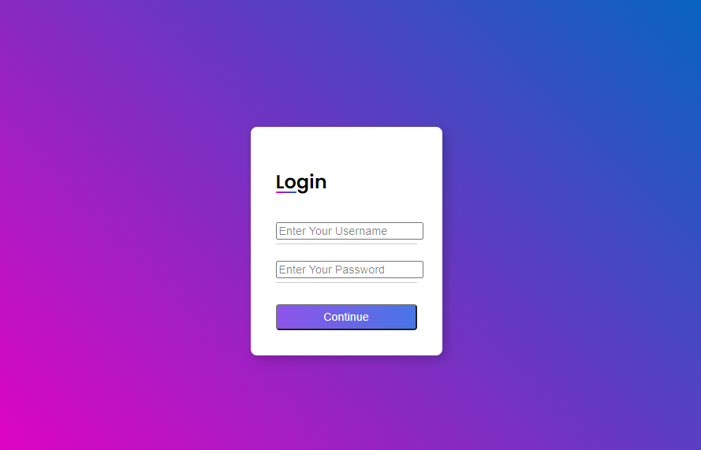

### Formulário de Login responsivo com HTML e CSS

Este projeto foi criado com um tutorial do youtube.
  
**Youtube link:  [https://youtu.be/MkXuQ9CcHqU](https://youtu.be/MkXuQ9CcHqU)**

### Resultado final

### 🚀 Iniciando

Para iniciar o projeto, apenas abra o arquivo `index.html` em seu navegador favorito.

---
##### Criado com base no tutorial da Giovanna Moeller :)
